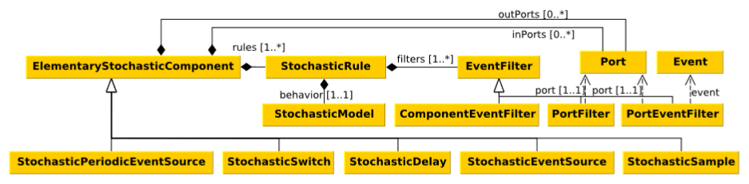

# Stochastic Gamma Modeling

In this section, Stochastic Gamma Composition Language (SGCL)  is introduced. 
Gamma Composition Language (GCL) uses high-level engineering modeling languages, hierarchical decomposition, and mixed semantics to facilitate the modeling of complex CPS systems, yet GCL can model only deterministic functional behavior.
SGCL is based on GCL and extends mixed semantics modeling with stochastic components for extra-functional modeling of dependable cyber-physical systems. The semantics of SGCL is available here: [LINK](http://inf.mit.bme.hu/sites/default/files/gamma/documents/stochastic_gamma_semantics.pdf).
As a result, engineers can develop the extra-functional model of the CPS systems by extending the functional GCL behavior with extra-functional, stochastic modeling elements. A typical use-case for SGCL is extending the synchronous software model with a stochastic asynchronous environment model.
Using stochastic components, engineers can directly model unpredictable phenomena within the CPS system or in its environment, such as random hardware failures, communication or process delays, measurement noise, lost communication packages, and user requests.  

## Stochastic Composition Models

### Asynchronous Composition

Using SGCL, one can use asynchronous composite components, to define structure models where the components can interact instantaneously. Similarly to synchronous composite components, an asynchronous composite component can contain ports, port bindings, asynchronous component instances, and channels.
In asynchronous composite components if there is an incoming event in the input port of a subcomponent then the event affects the other parts of the component right away. 

Stochastic asynchronous composite components are asynchronous composite components, which can contain elementary stochastic components and the instances of other stochastic asynchronous components. In addition, stochastic asynchronous composite components can contain deterministic asynchronous component instances.  
One can define a deterministic and a stochastic asynchronous composite component using the *async* and the *stochastic async* keywords respectively. In all other aspects, the definition of asynchronous composite components is the same as the definition of the synchronous composite components.

```
stochastic async Component1 [
    //ports
]{
    //components, channels and bindings
}
```

### Synchronous Composition

Synchronous composite components are structure definitions, which contain deterministic synchronous component instances, the channels between the subcomponents and port bindings. If a composite component recieves a trigger event, then the component sequentially executes its subcomponents. During execution, the events in the channels are transmitted among the subcomponents. The execution order and the rules of event transmission are defined by the type of the composite component, which can be a synchronous-reactive or cascade.

Stochastic synchronous composite components are synchronous composite components, which can contain stochastic subcomponents. Similarly to a deterministic component, a stochastic synchronous component may have synchronous-reactive and cascade behavior. A stochastic synchronous components may contain elementary stochastic components and stochastic synchronous composite component instances beside deterministic synchronous component instances. Using stochastic components, engineers can model the extra-functional properties of the software components, such as communication messages are lost with a given probability or a software component fails seemingly at random times.

One can use the *sync*, *cascade*, *stochastic sync* and *stochastic cascade* keywords to define the aforementioned types of composite components. After the keyword, the name of the component shall be specified. The channels, port bindings, and component instances shall be specified within curly brackets. 

```
stochastic sync Component1 [
    //ports
]{
    //components, channels and bindings
}
//...
stochastic cascade Component2 [
    //ports
]{
    //components, channels and bindings
}
```

## Elementary Stochastic Components

In SGCL, the deterministic and the stochastic behavior models are separated completely.
I can add stochastic behavior to the deterministic descriptions with elementary stochastic components. The class diagram of the stochastic behavior models is depicted below. 



Elementary stochastic components are atomic components, where the occurrence of the output events has stochastic behavior. There are five types of elementary stochastic components, such as stochastic event source, stochastic delay, stochastic switch, and stochastic sample. Each type models a different kind of stochastic behavior that may occur in CPS systems. Elementary stochastic components can model that an event occurs randomly, an event is delayed randomly, an event goes out in a randomly selected port, and an event has a random parameter.


### Stochastic Rules

In elementary stochastic components, one can assign a stochastic model to output events with stochastic rules. A stochastic rule contains a stochastic model and an event filter, which references a set of output events of the elementary stochastic component. A stochastic model can be a distribution or a probability. In stochastic rules, engineers can use arbitrary distributions even multinomial and time-dependent distributions. There are three types of event filters: port event filter, port filter, and component filter. The port event filter references a given event of a given output port. The port filter references all events of a given output port. The component filter reference all output events of all output ports. 

In a stochastic component, an output event can be specified by two different event filters if the type of the event filters is not the same. In this case, the more specific event filter will assign a stochastic model to the output event.  For example, in a stochastic component, there are two stochastic rules: one has a component filter, and one has a port event filter. Then in this component, the stochastic rule with the port event filter specifies assigning a stochastic model to an output event. 
All the other output events have the stochastic model of the rule with the component filter.


### Stochastic Event Source

In SGCL models, stochastic event sources define components that generate output events in a randomly selected time. 
The time when a stochastic event source activates its outgoing events is determined by distribution. The distribution of the occurrence time is assigned to the output events by stochastic rules. In stochastic event sources, each outgoing event is activated only once per simulation. 
A stochastic event source contains any number of output ports but no input port. Stochastic event sources can model one-time random events such as random hardware failures.

There is another type of stochastic event source called stochastic periodic event source. In contrast, stochastic periodic event sources can activate their output events multiple times. The periodicity of the events is defined by a stochastic distribution. As a result, the occurrence of the output events follows a renewable process. Stochastic periodic event sources can model user requests, transient faults, and clock events.


```
source EvenSource1 port Port1 : provides Interface1 {
    Port1.Event1 : Exponential(10.0);
}
periodic source EvenSource2 port Port1 : provides Interface1 {
    Port1.Event1 : Exponential(10.0);
}
```

### Stochastic Delay

Stochastic delay components send out all incoming events after a random delay. A stochastic delay component contains only one input and output port, which has the same interface. A stochastic delay component never changes the parameters. The parameters of the input event instances are the same as the parameters of the corresponding output event instances.
Stochastic delay components activate their output events after a randomly distributed time the corresponding input event occurs. The distribution of the stochastic delay is defined with stochastic rules.  Stochastic delay components can model communication delays, processing delays, user interactions, and repair events.

```
delay Delay1 port PortIn : requires Interface1 ->
    port PortOut : provides {
        PortOut.*: Normal(1.0,0.2);
}
```

### Stochastic switch

Stochastic switch components send out the incoming events instantaneously into a randomly selected output port. A stochastic switch component has only one input port and multiple (at least two) output ports. All the input and the output ports have to have the same interface. With stochastic rules, one can assign a probability to each outgoing port, and the sum of these probabilities has to be one. If an input event occurs, these probabilities define in which port the event will be sent out. The parameters of the input events are the same as the parameters of the corresponding output event. Stochastic switch components can model packet loss during communication and latent fault of diagnostic mechanisms.

```
switch Switch1 port PortIn : requires Interface1 ->
    port PortOut1 : provides, port PortOut2 : provides, {
        PortOut1.* : 0.6;
        PortOut2.* : 0.4;
}
```
### Stochastic sample

Stochastic sample components have only one input and one output ports, which have the same interface. Stochastic sample components send out the input events into the output port instantaneously. The parameters of the output event instances might be different from the corresponding input event instances. I can use stochastic rules to assign a distribution to the first parameter of the output events. Therefore each time the output event is raised, the specified parameter will be a random sample of the corresponding stochastic distribution. With stochastic sample components, engineers can model sensor and diagnostic faults and measurement noise. 

```
delay Sample1 port PortIn : requires PInterface1 ->
    port PortOut : provides {
        PortOut.Event2::Parameter1 : Uniform(0.0,1.0);
}
```