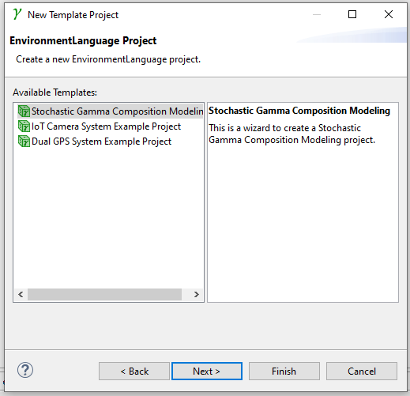
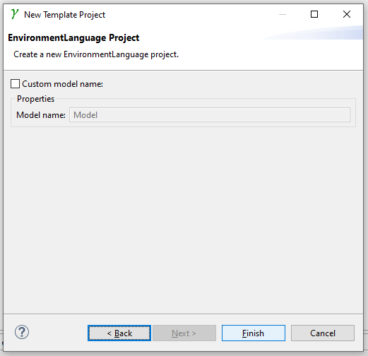

# Quick installation

 1. Dowload „stochastic-gamma-product.zip” from  [LINK](https://www.xyz.com) and unzip the content of the archive into a folder, where you want the Stochastic Gamma to be installed
    - If you want to use SysML dependability modeling, then copy the "ealib.jar" from the installation library of Enterprise Architect to "*...\stochastic-gamma\plugins*" folder of Stochastic Gamma installation.
 1. Download „zip” from [LINK](https://www.xyz.com) and extract the .zip file into a folder, where you want the python interpreter with the pre-installed python packages to be installed
    - You can use any python interpreter if you install (matplotlib, torch, numpy and pyro-ppl).
 1. Install „GraphViz” 
 1. Run „stochastic-gamma.exe”
 1. Choose a „workspace” location, a folder where you want to store the modeling projects.
 
 1. If you open a python file this pop-up window will appear, click on „Manual Config”
 
 1. Click on „New” and choose „Browse for python/pypy exe” (you can go to this menu manually: Window/Properties/PyDev/Interpeters)
 
 1. Click on “Browse” and find the installation location of PyroEnv and click “OK” and click "OK" again
 

## Create empty project

1. Make sure you are using the *Stochastic Gamma* perspective. 

   

2. Click on the "New" button in the menu bar.

   

3. In the *Stochastic Gamma* cathegory choose *Stochastic Gamma Project* and click *Next*.

   

4. Name the project and click *Next*.

   

5. Choose "*Stochastic Gamma Modeling Project*" and click *Next*.

   

6. Click *Finish*.

   