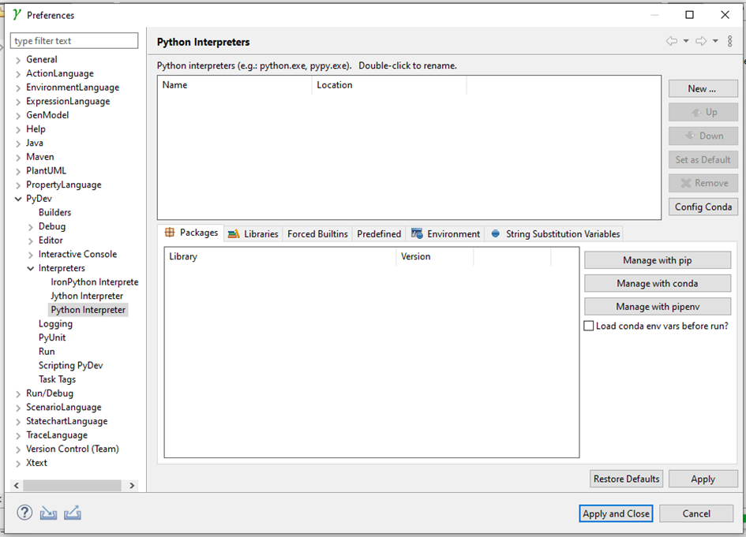

# Quick installation

 1. Dowload „stochastic-gamma-product.zip” from  ... file into a folder, where you want the modeling environment to be installed
 1. Download „zip” from ... and extract the .zip file into a folder, where you want the python interpreter to be installed
 1. Install „GraphViz” 
 1. Run „stochastic-gamma.exe”
 1. Choose a „workspace” location, a folder where you want to store the modeling projects.
 
 1. If you open a python file this pop-up window will appear, click on „Manual Config”
 
 1. Click on „New” and choose „Browse for python/pypy exe” (you can go to this menu manually: Window/Properties/PyDev/Interpeters)
 
 1. Click on “Browse” and find the installation location of PyroEnv and click “OK” and click "OK" again
 

# Create your first model

# Run analysis