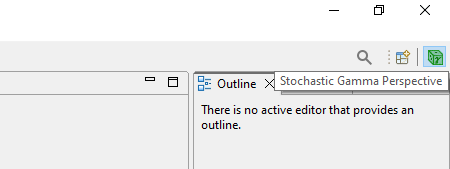
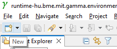
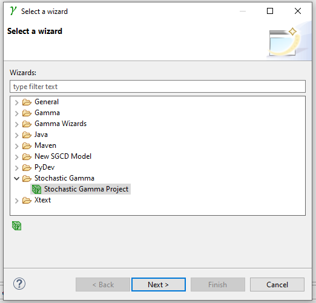
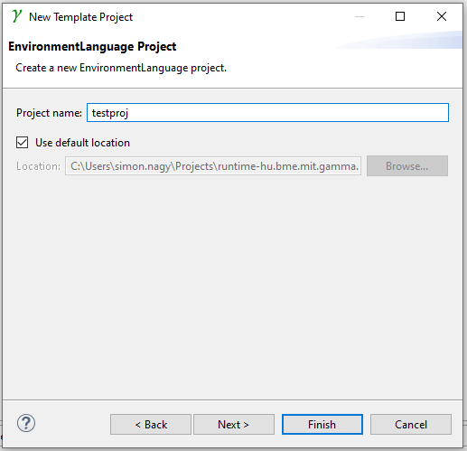
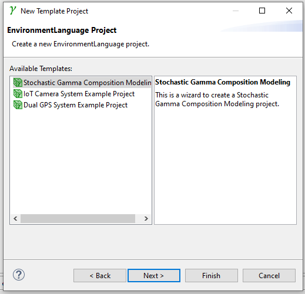
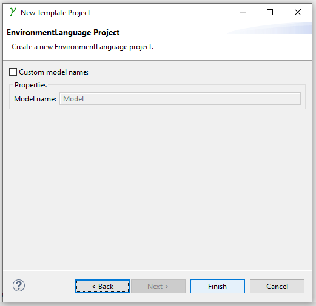

# Getting Started with Stochastic Gamma

This tutorial shows you:
 - how to install Stochastic Gamma, 
 - how to create your first dependability model and
 - how can you evaluate the model.

## Installation

1. Install graphviz from [https://graphviz.org/](https://graphviz.org/)
1. Download Stochastic Gamma from [ftsrg.bme.hu](ftsrg.bme.hu) 
2. Unzip the content of the file into any folder, where you want Stochastic Gamma to be installed.
3. Run the "stochastic-gamma" file	


## Create empty project


1. Make sure you are using the *Stochastic Gamma* perspective. 

   

2. Click on the "New" button in the menu bar.

   

3. In the *Stochastic Gamma* cathegory choose *Stochastic Gamma Project* and click *Next*.

   

4. Name the project and click *Next*.

   

5. Choose "*Stochastic Gamma Modeling Project*" and click *Next*.

   

6. Click *Finish*.

   


## Create Gamma Interface definitions

Interface definitions specify how components may interact with each other. Each interface contain a given set of event definitions. Events may have parameters, which specify the properties of the event occurrences similarly to UML signals and (signal's) attributes. Events are directed. Interfaces can be defined within packages.

Please copy-paste the following code into the *interfaces.gcd* file:

```java
package interfaces

interface Sensor {
	out event failstop
}

interface HardwareFailure {
	out event failure
}

```

If you select the PlantUML view and (left) click on *interfaces.gcd* in the project explorer then you can see the graphical repesentation of the interface model:

## Create Gamma Statechart definitions

In Gamma, statecharts specify the behavior of atomic components, which have no internal structure.


