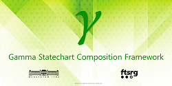

# Stochastic Gamma Documentation

This is the documentation of Stochastic Gamma Composition Framework.
The contents of this page are the following:
   - Getting started guide
   - Buid and installation guide
   - Stochastic Gamma Tutorials
   - Documentation of Stochastic Gamma Modeling Language
   - Documentation of SysML dependability extension