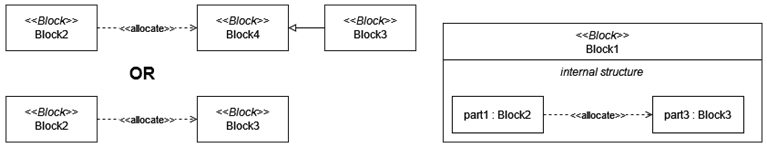
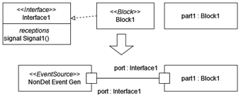
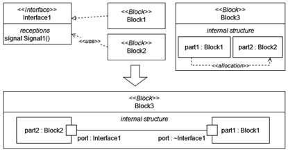

# Abstraction Layer Profile

This section introduces the modeling elements of the AbstractionLayers profile. The definitions of the stereotypes in the AbstractionLayers profile are the following:
  - ***AbstractionLayer***: A collection of modeling elements, which represent the system from a given point of view
    - Abstrcation among layers: Abstraction relationship between two abstractio layers defines, that a given abstraction level is more abstract (or less specific), than another. The allocation is possible of those elements, of which abstraction levels are connected with this relationship.
    - Limitation: The current version of Stochastic Gamma supports only two abstraction levels functional and physical.

# Allocation rules

This section defines, what kind of allocations are allowed among elements in different abstraction layers.

  - Part allocation Rule: Within a block the allocation among parts specifies that a part requires another part for correct operation. Two blocks can be allocated to each other if they are on different abstraction levels and there is an abstraction relation between the two abstraction layers. For instance, within a EE subsystem a software component can be allocated to a microcontroller, which specifies that the microcontroller is required for the correct operation of the software component, since the microcontroller executes the software component. 
     - Two part can be allocated to each other if: The types of the parts allocated to each other OR
     - The types of the parts specialize other blocks which are allocated to each other.

  - Subpart allocation rule: Within a block, internal parts of other parts can be allocated to each other. For instance, a function of an EE subsystem may contain subfunctions, which can be allocated to different hardware components of the EE subsystem.

# Error propagation with allocation rules

This section specifies the error propagation rules, yet these rules can be used for other extra-functional aspects. This set of model-transformation rules defines the semantics of the error and threat propagation. 
  - Realized ErrorAspects without allocation: If a block realizes interfaces, then it specifies that the block can perceive the received signals of the interface. The behavior models of the block can refer to these signals in signal events. If no other rule specifies the occurrence of the signals, then the signals may occur nondeterministically.

  - Realized and used ErrorAspects with allocation: If a block uses a given interface than it specifies that the component can be the source of all the signal events, which are defined in the signal receptions of the used interface. If two parts are allocated to each other and the types of the parts realize and use the same interface, then the ports of the interfaces shall be connected.

