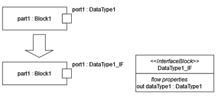
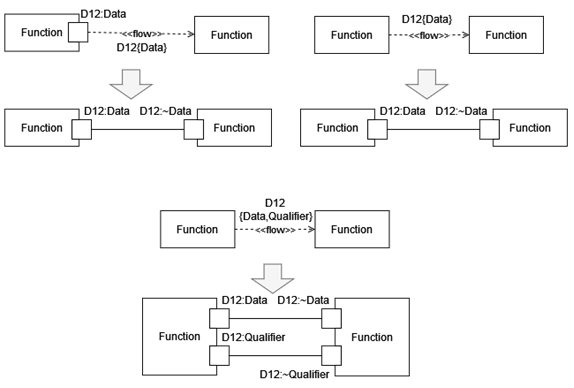
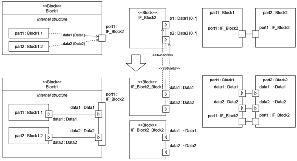
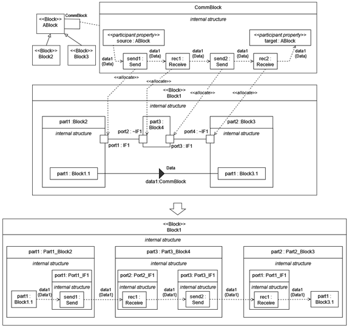

# Communication modeling rules and patterns

  - DataType port rule: DataType can be used as a port classifier, which is equivalent if the port's classifier is an interface block, which has exactly one flow property. The type of the flow property is the data type and the direction of the flow property is "out". In any other rule, a DataType is used instead of an InterfaceBlock, then this rule shall be applied.
 
  - InformationFlow rule: Information flows can be used to define that port connections. If an information flow connects two ports, then it is equivalent to the connection of the two ports. If one or both end of the information flow is connected to a part instead of a port, then the conveyed item and the name of the information flow specifies the type and the name of the port, respectively. The port shall be defined in the type of the part. The connection rules are the following:
     - If the type of the part has only one port of which type equals to the conveyed item, then the port with the same type is chosen.
     - If the type of part has multiple ports of which type equals to the conveyed item, then the port is chosen by its name. The name of the port and the name informtion flow must be equivalent.
     - If an information flow contains multiple conveyed items then it is equivalent to multiple information flows, with the same name and with exactly one conveyed item of the items of the original information flow.
 
  - Composite port rule: If more information flows are connected to a port, than it is equivalent to composite port connection. In this case the composite port contains has multiple subports, and their name and types are specified by the name and conveyed item of the information flow.
 
  - Port transmission rule: The sub-ports of the type of ports can be allocated to other blocks, which specifies that the ports has internal 'boundary' parts.
 
  - Communication path rule: One can use this modeling pattern to separate the communication modeling from the information flows. As a result, one can hide all the communication functions using connectors and association blocks. Information flows can be added to connectors. In this case, the flow specifies, what information is transmitted, and the connector and the type of the connector specify, how the information is transmitted. Association blocks can be used to precisely define the type of the connectors, the way the data is transmitted. Parts of the association block can be allocated to ports on lower abstraction levels. This way engineers can easily model, if an information flow goes through multiple components before reaching its destination. It is advantageous, to define the association block between an abstract block, and all the other blocks, among which the communication is specified,  specialize the abstract block.
 
