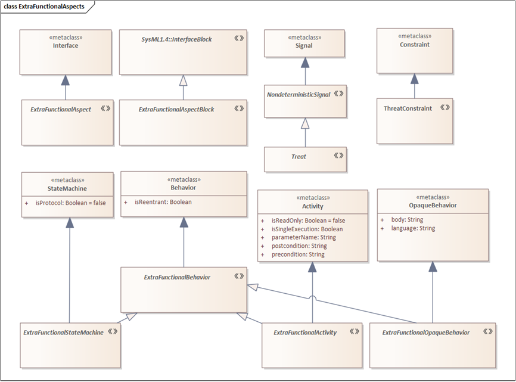

# Profile of Extra-Functional Aspects

This profile contains abstract stereotypes, which define abstract non-deterministic aspects. The model-transformation approaches and tools use only this profile. Stereotypes from other profiles can specialize the nondeterministic stereotypes. All other stereotype-related information is domain-specific and helps only for the engineers to handle and understand the models.
The definitions of stereotypes are the following:
  - ***NondeterministicSignal***: An instantaneous phenomenon, which is not part of the nominal, functional behavior of the system and the occurrence time of the phenomena cannot be predicted.
     - Attributes of the threat: The parameters of the threat occurrences. The actual value of the parameters is nondeterministic, cannot be predicted.
  - Threat: Threat specializes NondeterministicSignal. The phenomena directly or indirectly affect the dependability, performance or security of the system.
  - ***ExtraFunctionalAspect***: The collection of threats and behaviors, which are related to a given type of extra-functional aspect.
     - Realization between aspect and classifier: The classifier has all attribute, reception and behavior of the aspect.
     - Signal receptions of the aspect: The list of threat, which belong to the given extra-functional aspect.
  - Constraint: The signal of the reception must be a threat. 
     - Attributes of the aspect: The list of extra-functional attributes, which belong to the given extra-functional aspect.
  - ***ExtraFunctionalAspectBlock***: The collection of threats and behaviors, which are related to a given type of extra-functional aspect.
     - Realization between aspect and block: The block has all flow properties, reception and behavior of the aspect.
     - Signal receptions of the aspect: The list of threat, which belong to the given extra-functional aspect.
     - Constraint: The signal of the reception must be a threat. 
     - Flow properties of the aspect: The list of directed flowing items, which belong to the given extra-functional aspect and may affect the related system element.
  - ***ExtraFunctionalBehavior***: This behavior specifies the behavior of system elements related to the given aspects. There are three types of extra functional behavior: extra-functional state machine, activity and opaque behavior.
  - ***ThreatConstraint***: Vulnerability extends constraint metaclass. Vulnerability specifies what kind of conditions can cause the occurrence and activation of threats. Vulnerability specifies the constraints of threat occurrences, whether is it a transient or permanent and how many times the threat can occur.

# Profile of Dependability and Error behavior

The ErrorModeling profile contains the dependability extension of the ExtraFunctionalAspects profile. 
The definitions of the stereotypes are the following:
  - ***Fault***: Fault is the specialization of the abstract nondeterministic threat. A fault is an instantaneous phenomenon, which may cause the system or system components to malfunction and can be the root cause of other errors and failures.
  - ***Error***: Error extends the state metaclass. Error is the state of a system element, which may lead to system failure.
  - ***Failure***: Failure is the specialization of the abstract nondeterministic threat. Failure is an instantaneous event, when the system or a system element (i.e.: component, function, subsystem) transitions from a correct operation state into an incorrect one.
  - ***ErrorCondition***: ErrorCondition specializes constraint metaclass. An ErrorCondition specifies an error, which occur if a given first order logic formula is true. An error condition can become true during the operation of the system and true condition means that the containing system element is in a given error state. ErrorCondition is introduced to define erroneous state and attribute valuation. ErrorCondition can be used instead of new parallel regions. 
  - ***ErrorPropagationBehavior***: ErrorPropagationBehavior specializes ExtraFunctionalBehavior stereotype. Error propagation behavior specifies, how a system element reacts to the failure of other system elements and the error can propagate. There are three types of error propagation behavior ErrorStatemachines, ErrorActivities and ErrotOpaqueBehaviors.
  - ***FaultConstraint***: FaultConstraint specializes ThreatConstraint spereotype. Fault constraint defines when and how a fault can occur (i.e.: a random hardware fault occurs once and the occurrence time is exponentially distributed).
  - ***ErrorAspect***: Error aspect specializes ExtraFunctionalAspect. Error aspect specifies the faults and failures of a system elements.
    - Realized ErrorAspect of an interface or interface blocks (an interface or an interface block is connected to an ErrorAspect with realization)  specifies, what kind of failures can propagate through a given interface.
    - Used ErrorAspect of a component, function or subsystem specifies (a class or block is connected to an ErrorAspect with realization), what kind are its high-level failures, which may affect other components, which are allocated to the component/function/subsystem.
    - Realized ErrorAspect of a component, function or subsystem (class or block is connected to an ErrorAspect with realization)  specifies, what kind of faults and failures can affect the state of the component, function or subsystem. If the ErrorAspects contains the receptions of failures, it means that if the system element is allocated to another system element and the system element produces this failure, than it failure of the component will affect the internal state of the original allocated component.
    - Attribute of ErrorAspect: It means that some dependability-related property of a system element may affect the dependability of other system elements. For instance, the integrity, availability and timeliness of a measurement can affect other parts of the system, which use this measurement.
  - ***ErrorAspectBlock***: Error aspect specializes ExtraFunctionalAspectBlock. ErrorAspectBlock is similar to ErrorAspect, yet in error aspect block, flow properties can be used to model error propagation.
    - FlowProperty of ErrorAspectBlock: Similarly to the attribute of ErrorAspect, the flow property means that some dependability-related property of a system element may affect the dependability of other system elements. In contrast to attributes, flow properties may have multiple directions.
    - FlowProperty of ErrorAspectBlock: It means that some dependability-related property of a system element may affect the dependability of other system elements. For instance, the integrity, availability and timeliness of a measurement can affect other parts of the system, which use this measurement.

# Dependability and Performability Analysis of SysML models using Stochastic Gamma

The suggested application of Stochastic Gamma is discussed in this section. The analysis approach consists of four major steps: 1.) Develop system architecture, 2.) Extra-functional modeling, 3.) Simulation-based Dependability Verification, and 4.) Developing Implementation Workproducts. The architectural design defines the system behavior on multiple abstraction layers, separating the physical components and subsystems from their logical role and functionality. 
Thereafter, both the functions, components, and interfaces are supplemented with extra-functional aspects specifying their timing, failure modes, and internal error propagation. The model-driven verification transforms the extended engineering models into a error propagation simulator and verify the dependability automatically. If the architecture does not satisfy the requirements, the design can be iterated. If the requirements are satisfied, then in the final step of the approach, implementation workproducts, such as software architecture, electrical schematics, mechanical design constraints, and test cases, can be developed using the system architecture.

To analyze the extended dependability models, we transform the SysML engineering models into a low-level formal modeling language called Gamma. Thereafter, we use the simulation capabilities of Gamma to systematically simulate different malfunction scenarios and evaluate their high-level effect on the substation. Each malfunction scenario contains some failures of the protection-related components and ends with the occurrence of a high-voltage short-circuit. After the simulation of the failure scenario, the simulator is reset. Finally, our approach evaluates the malfunction scenarios to verify dependability requirements and find systematic weaknesses in the system architecture.