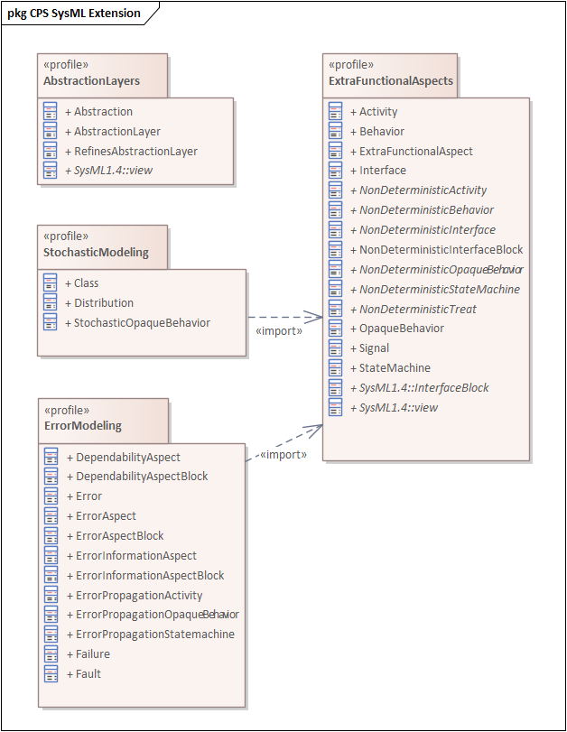

# SysML modeling using Stochastic Gamma

## Core concepts

This section presents the main modeling decisions, we made during the definition of the error metamodel.
  - Modularity and extensibility: Our objective was to create a universal approach, which can be used in multiple application domains with different terminologies. The nondeterministic, stochastic and extra-functional aspects are separated into interdependent UML profiles. The error behavior is a specific kind of nondeterministic behavior. During analysis, engineers can resolve the nondeterminism with stochastic models using industrial standards, accelerated aging tests and environmental profiles. 
  - Extendable abstraction layer and allocation modeling: As the error propagation within distributed systems include software, electrical and mechanical behaviors simultaneously, we defined a modeling approach to define domain-specific abstraction layers (such as mechanical, software and functional modeling layers). Allocation among the modeling layers can define the traceability among the modeling elements, among the abstraction layers. In addition, extra-functional, threat propagation modeling patterns are defined to support the error propagation modeling across multiple abstraction layers (i.e.: if a microcontroller is faulty, then all software functions become faulty, which are allocated to the microcontroller). 
     - View-based abstraction layer modeling: All abstraction layers are views with "AbstractionLayer" stereotype. If an abstraction layer exposes a package, then all classifier within the package belong to the given abstraction layer. If an abstraction layer exposes a profile, then all modeling elements, which has a stereotype from the profile belong to the abstraction layer.
  - Standard behavior semantics: Our objective was to define the extra-functional behavior of the components and functions (such as error propagation behavior within a component) using solely state-of-the-art statechart and activity semantics. All extra-functional behavior and error propagation formalisms are UML formalisms. Thus, engineers don't have to learn new execution semantics. Moreover, existing simulators can be used to evaluate the dependability models.
     - Signal-based threat modeling:  The different types of threats, such as errors, faults and cyber attacks are stereotyped signals. As a result, we can use state-of-the-art UML-based behavior modeling approaches for specifying error propagation. For instance, error statemachines are UML statecharts, where the error states are marked with a stereotype, and component fault trees are activity diagrams, where AND and OR gates are join and merge nodes, with a custom stereotype and appearance.
  - UML and SysMLv1 support: The extra-functional stereotypes extend both UML metaclasses and SysMLv1 stereotypes, in order to support both SysMLv1 and domain-specific UML based modeling approaches.
  - Communication network support: To manage distributed fault-tolerance solutions, the modeling approach includes a modeling extension for communication modeling, independently from the extra-functional models. The communication modeling approach enables engineers to use information flows, association blocks and full ports for concise and transparent modeling. The communication modeling approach defines intuitive modelling patterns, to separate the low-level communication channel definitions from the high-level functional and application models.

