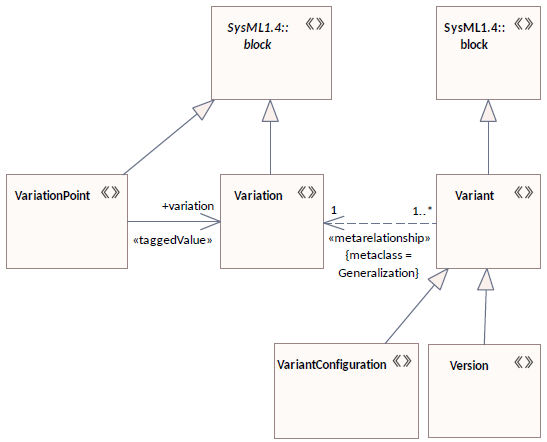

# SysML variant modeling using Stochastic Gamma

The SysML-based dependability modeling of Stochastic Gamma fully support the modified VAMOS variant modeling tool. The variant handling extension of Enterprise Architect is available here: [LINK](https://github.com/szondakata/VariantHandling). The main concepts of variability modeling are built on the top of generalization and redefine sematics. 

## Variant Modeling Profile

This sections presents the modeling elements of the modified VAMOS approach for the better understanding.

 - ***Variation point***: A variation point is an element of the model where the variants differ. The variation point represents a place (structural modelling) or role (behavioural modelling), which shall be filled later by the configured variant. To every variation point, a set of variants, a variation shall be connected. The connected variation collects the candidate  components that can later fill the role.
 - ***Variant***: A variant is a model element. A variant is developed based on an interface given by the implemented variation point. It encloses the properties which distinguish variants of the model from each other. This difference can be the used algorithm or physical properties like operating voltage or temperature. The only limitation is that the variant must realize the interface defined in the variation the variant is part of. In special cases, for example, when a variant is used to declare that the component is not used in the configuration, properties of a variation point can be redefined. If a model element is a variant, the contained model elements are also part of the variant by default.
 - ***Configuration***: A configuration is always connected to one specific model, called a system model. A configuration is a map where the map’s keys are the system model’s variation points. The values of the map are variants. For every key-value pair, the variant must be part of the variation connected to the variation point.
A configuration can be complete if all of the system model’s variation points are part of the configuration. A configuration is a partial configuration if some, but not all, of the system model’s variation point is part of the configuration.
 - ***Variation***: A variant is a model element. A variant is developed based on an interface given by the implemented variation point. It encloses the properties which distinguish variants of the model from each other. This difference can be the used algorithm or physical properties like operating voltage or temperature. The only limitation is that the variant must realize the interface defined in the variation the variant is part of. In special cases, for example, when a variant is used to declare that the component is not used in the configuration, properties of a variation point can be redefined. If a model element is a variant, the contained model elements are also part of the variant by default.
 - ***Variation***:

## Variant Modeling of Variants

The variability modeling extends the UML's generalization and redefine relationships with additional variant-specific attributes. The error models are handled as standard SysML and UML behavior and interface models.
  - Extra-functional aspects and aspects of variants: If two variants generalize each other then the specialized variant will inherit the generalized variant. 
  - Extra-functional aspects and aspects of variants and variation points: If a variation point has a variation point realizes or uses an extra-functional aspect, then all of its variants will inherit the aspect.
  - Extra-functional behavior of variants: Variation points cannot contain extra-functional behavior. Only variants can have extra-functional behavior. If two variants generalize each other and the generalized variant have extra-functional bahavior and the specialized does have none, then the specialized variant will inherit the extra-functional behavior of the generalized variant. 