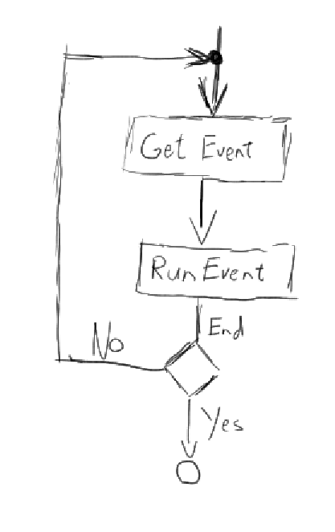
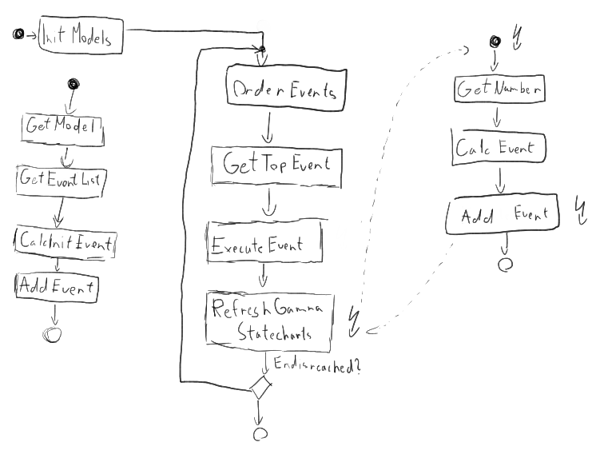

# Transformation steps

## I. Collecting the elementary environment instances

 1.) Recursive exploration of subcomponents
 
   * Logging the component hierarchy during exploration
   * Using recursive **dispatch** functions  
 
 2.) Collect the instances and their connections into 
 **EnvironmentConnection** classes
 
   * Use **Builder** class 

## II.  Generating Python classes and objects from instances

### Generate probabilistic program

  * elementaryComponent.StochasticRule -> rules
  * rules is a double dict (a dict in dict) rules [<name of port>] [<name of event>] = <behaviorModel> 

  * StochasticModel and ExternalSimulation -> behaviorModel 
  * use <behaviorModel>.calc(<event>) to get the sample from 
  the stochastic model or get the value of the simulation 
    *  event is the (string) name of the occured event with port name 
    in case of simulation an "if-else" structure is advised to 
    handle the events in the calc() function
    * event format **<name of the port>.<name of the event>**
  * call are the connections where the outport are connected to: 
  	  * call=self.detmodel«callName»
  	  * calls is a dict [<name of port>]=list of ports where the given port is connected
  	  * in case ov event sources calls is different:
  	    * calls is a dict [<name of the port>][<name of the event>]=raise the event
  * with getEvent the main probabilistic simulator can poll the events of every component
    * if you run this functions the internal event list will be cleared
  * portevents is a dict: portevents[<name of port>] = lost of events of the port's interface
  * switch generation is different from other components
    * for random switches we generate an array, called portarray for the out ports 
    * we generate a categorical distribution to get the index of the out port
    * thus outport[categorical.sample]=outport
    * categrical 

### Generate Py4J Gateway class

## III. Organizing the probabilistic program

Basic flow of the simulation

Detailed flow of the simulation

### Cosimulation with external simulators